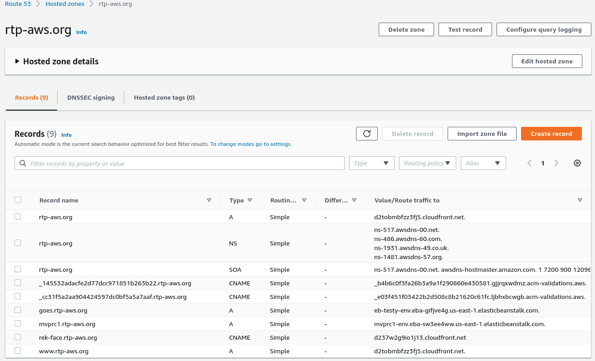
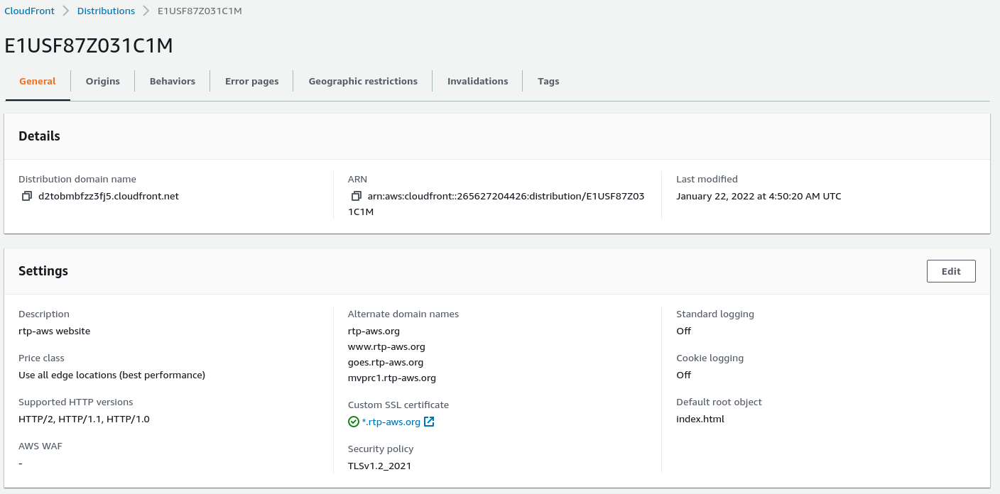
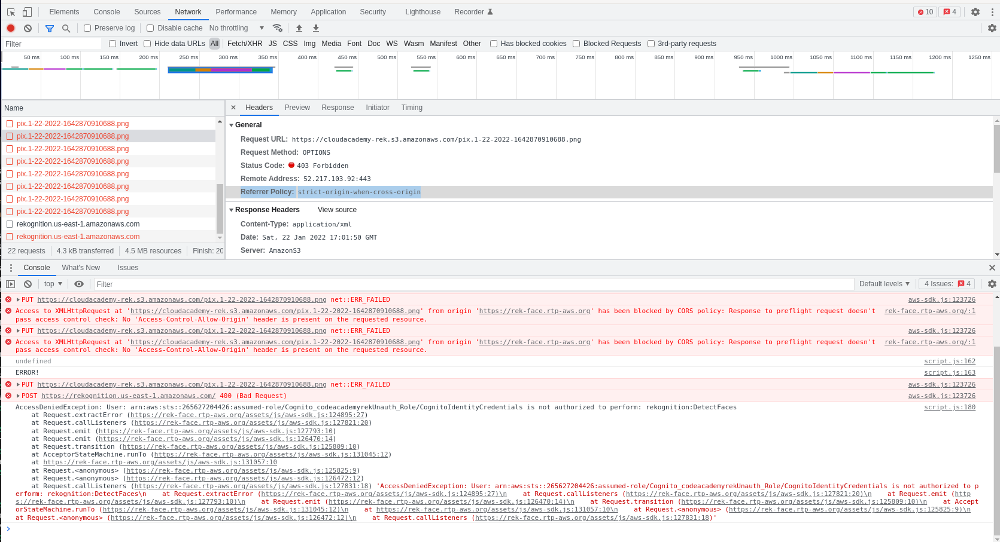

# Associated course

This code is discussed [here](https://cloudacademy.com/course/amazon-rekognition/demonstration-facial-analysis-web-app/).

# Setup aws S3 bucket

Used to store uploaded photos (images) from the user's (browsers) web cam.

The name and region will be used in the `script.js` code.

# Setup aws cognito

Used to get access to aws resources.

The IdentityPoolId setup below will also be used in the `script.js` code.

> Amazon Cognito provides solutions to control access to AWS resources from your app.

The service is found under 'Security, Identify, & Compliance'


1. Click cognito service in aws console
2. Click "Managed Federated Identies" button
3. Enable "Enable access to unauthenticted identities"
4. Click "create pool" button

The next screen has details which show this will setup the following roles for authenticated identities

The Role Name is Cognito_codeacademyrekAuth_Role

The Policy Document is

```
{
  "Version": "2012-10-17",
  "Statement": [
    {
      "Effect": "Allow",
      "Action": [
        "mobileanalytics:PutEvents",
        "cognito-sync:*",
        "cognito-identity:*"
      ],
      "Resource": [
        "*"
      ]
    }
  ]
}
```


The next screen has details which show this will setup the following roles for unauthenticated identities

The Role Name is Cognito_codeacademyrekUnauth_Role

The Policy Document is

```
{
  "Version": "2012-10-17",
  "Statement": [
    {
      "Effect": "Allow",
      "Action": [
        "mobileanalytics:PutEvents",
        "cognito-sync:*"
      ],
      "Resource": [
        "*"
      ]
    }
  ]
}

The difference is in the "cognito-identity" entry.
```


5. Click "Allow" button

This shows the "Getting started with Amazon Cognito" screen.  It has AWS SDKs for various platforms.

6.  Get the "Identity pool ID" in the first stanza identified as "Get AWS Credentials".  Copy the string associated with the comment `// Identity pool ID`

```
"us-east-1:44456c50-199b-4fe8-8ec5-8337b329051b", // Identity pool ID
```

Paste this code in the javascript code script.js for the variable `IdentityPoolId`

# Deploying the web app

## Update the web app
Once the three variables in script.js are set.  Zip the code and upload.

```
~/aws-machinelearning/rekognition/demo-sdk$ zip -r web.zip .
```
## Create a static web page

NOTE: At this point, the video shows how to host a static web app using quick start, but it is no longer
on the aws console.  Instead it has been replaced with AWS Amplify.  These instructions partially conver th
method in the video for Setting up Route 53, S3, CloudFront, but the video does not cover how to specify
the updated method for the differences between Amplify Apps and Elastic Beanstalk apps.

1. Click the 'aws' icon in top left
2. Scroll down to `Build a solution` tile at bottom of page
3. Click the `Host a static web ` with AWS Amplify Console.  
> Note the video refers to a entry no longer listed.  If you search you will find
[this](https://aws.amazon.com/getting-started/hands-on/host-static-website/) but even
it is in aws Amplify.

4. Click "Deploy without git provider"
5. Give name "CloudAcademyRekognitionWebApp"
6. upload the `web.zip` created earlier.
7. Note the Domain, in this case `https://test.d360yg3fm3vqo1.amplifyapp.com/`

# Static Website Hosting with AWS

This is a third revision on the notes to host
a website with aws.


# S3 hosted method

S3 bucket storage will host the website contents.

## Create bucket

These are the steps for S3.

1. create bucket name rtp-aws.org
2. use region us-east-1
3. use the default acls
4. disable the block all public access checkboxes.
5. click create bucket.
6. select the bucket to edit.
7. click properties. select static website hosting.
8. specify index.html as homepage.
9. click save changes.
10. Click permissions

remove all block public access if not done by now

11. Edit policy

Using this guide, https://docs.aws.amazon.com/AmazonS3/latest/userguide/WebsiteAccessPermissionsReqd.html

Grab the sample policy and edit bucket name to be `rtp-aws.org/*`

## Route 53 and register.com - Part 1

Register.com will still own the domain, but
will use the DNS servers provided by Route 53

1. click services->Route 53
2. click dns managment->create hosted zone
3. enter domain name `rtp-aws.org`
4. click `public hosted zone`
5. for each of the four dns servers, add them as custom domains in register.com as custom name servers. >NOTE: omit the final dot for the name.


## CloudFront - part 1

CloudFront is a content delivery network

Go to cloudfront for the content delivery network.

1. Click distribution
2. Scroll down to "Request Certificate".  Click that and Certificate Manager opens.

### Certificate Manager

1. click request public certificate.
2. for domain name add `*.rtp-aws.org` This is for all hosts in this domain.
3. add another name add `rtp-aws.org.  This is considered an apex domain name.
4. select validation method.  Choose DNS validation.
5. click request


At this point you need to wait for them to complete validation.  
The `apex domain name` rtp-aws.org will validate rather quickly.  The
`*.rtp-aws.org` domain will require an email from register.com
to be confirmed.

Wait until Cloud Front says the *.rtp-aws.org certificate is issued.

Click the `Create records in Route 53`

## route 53 - part 2

In route 53, select the `rtp-aws.org` zone we created earlier.

Verify CNAME record is there.  I am not certain if you need to wait
for both domains to be valid before you will do this again.  As it is
now I only have one CNAME record in Route 53.  TODO: revisit this
later to see if we can add a second.


## Cloud Front - part 2


In first edit box for `origin domain` select rtp-aws.org.s3.us-east-1.amazonaws.com`

Origin Name will auto populate.  Leave blank the origin path edit box.

In `Default cache behavior->Viewer` select the radio button for `Redirect HTTP to HTTPS`


* `Alternate domain names (CNAME)` add items for:
    * `www.rtp-aws.org` This is for website
    * `rtp-aws.org` This is also for website
    * `testy-aws.org` Perhaps this is needed for the first web app
* `Custom SSL certificate` use the pull down to select the `*.rtp-aws.org (some letters)` for the cert.  NOTE: This is the wildcard certificate.
* In `Settings` at bottom, for the `Default root object` add `index.html`
* click `create distribution`

On the details of the `Distribution domain name` there is a fqdn for the
cloudfront host.  It says `d2tobmfzz3j5.cloudfront.net` that entry needs
to be used in route53 to create an A record.  Once that is done, at least the
route53 dns server resolves to the proper ip address.

NOTE: Regarding webapps.  For AWS Amplify, you do not want an entry in cloudfront.  For AWS
Elastic Beanstalk you do want an entry.


## route 53 - part 3

After you have copied the `Distribution domain name` value from the Cloud Front Distribution,
go back to Route 53.

* Click Create Record
* For record name, enter `www` with rtp-aws.org already specified
* For record type, specify `A`
* For Route Traffic to setting
    * Click the slide to `Alias`
    * Click pulldown to `Alias to CloudFront distribution`
    * In the search box look for the distribution which you copied, or just copy.
        > I waited long enough that it was present in the pulldown.

Do this for two of the domains you added in cloud front
* blank
* www

For an Elastic Beanstalk app, do likewise but instead of `CloudFront distribution`,
select `Elastic Beanstalk`.  Then choose which domain you want to use.

For an Amplify app, its a little different.  See below for details.  For now, just realize its done via a CNAME that Amplify will insert.  See the image below for a working static web site in conjunction with webapps via EB and Amplify.



NOTE: this shows the result after the Amplify steps done below.

* goes
* mvprc1

It also looks like when you go back to the certificate manager it has resolved
how to do the second certificate.  I thought two CNAME records would be added.
That is not the case.  Even after waiting when you go back, it will have
both certs grayed out, and it will say CNAME record is in Route 53.

Likewise, for Cloud Front, here is the result:



NOTE: once again this is the final result after the Amplify steps done below.

### Special Notes on Web Apps

## Elastik Beanstalk

* Create an entry in Cloud Front
* Create an entry in Route 53 which points to elastic beanstalk where the hostname
matches what is in Cloud Front

## Amplify

* Use Amplify to manage the domain.  It will create a cloud front distribution
and a Route 53 entry for you.  since we are hosting the website already with S3/Route53/Cloudfront
only specify the app name in the Domain DNS entry.  Remove the default hostnames.

### Baby Steps

In Amplify

1. Click `Domain Management` in left side bar
2. Click `Add Domain`
3. Enter domain `rtp-aws.org`
4. Click `Configure Domain`
5. Click `Exclude Root`, this takes out https://rtp-aws.org
6. Click `Remove`, this takes out https://www.rtp-aws.org
7. Click `Add`, `rek-face` and the test app name is only one given.
8. Click `Save`.  This brings up the bar graph.  Just wait for it to complete.


## App runtime and 403 on access to the S3 bucket

The app generates 403 errors during runtime after the take photo button is clicked.

1. Open chrome developer tools to the Network tab at the top.
2. Click on left the second file name.
3. Click the headers tab
4. Take note of the `403 error` where is says `Referrer Policy: strict-origin-when-cross-origin`

See screenshot below:



### Update S3 bucket

1. Open `S3` to `cloudacademy-rek` bucket
2. Click `Permissions`
3. Scroll down to the empty `Cross-origin resource sharing (CORS)` section
4.  Open in a new tab the `Learn more` link.
5.  In the next page, open in a new tab the example `CORS configuration`
6.  Scroll down to the `Example 1` section and click the `JSON` tab.
7. Copy the text from the example and modify or use this:
>
```
[
    {
        "AllowedHeaders": [
            "*"
        ],
        "AllowedMethods": [
            "PUT",
            "POST",
            "DELETE"
        ],
        "AllowedOrigins": [
            "https://rek-face.rtp-aws.org"
        ],
        "ExposeHeaders": []
    },
    {
        "AllowedHeaders": [],
        "AllowedMethods": [
            "GET"
        ],
        "AllowedOrigins": [
            "*"
        ],
        "ExposeHeaders": []
    }
]
```
8. NOTE: the video shows XML, but that no lgoner works. re. `The CORS configuration, written in JSON, defines a way for client web applications that are loaded in one domain to interact with resources in a different domain. `
9. Go back to the S3 CORS section. Click the `Edit` button and Paste above in the edit check
10.  Modify the domain for `www.example.com` to be `rtp-aws.org`
11. Click save.

### Update IAM Roles

1. Navigate to `IAM`
2. Click `Roles`
3. Search for `Cog` and then select `Cognito_codeacademyrekUnauth_Role`
4. Click and then search for `S3`
5. Click checkbox for `AmazonS3FullAccess`.  The video mentions this is for demo purposes only.
6. Or, click create policy, add `S3`. Restrict access to bucket `arn:aws:s3:::cloudacademy-rek`. Object `put` any. Name `jfdcodeacademyreckunuaths3putpolicy` and then select it.
7. click attach policy to `Cognito_codeacademyrekUnauth_Role`
8. Upon later testing, it shows that another policy needs to be created and attached to the `Cognitio_codeacademyrekUnauth_Role`.  Create policy, add `Rekognition`, specify `DetectFaces`, name it `jfdcodeacadameyrecognitiondetectfaces_policy`
9. Click `Roles`, click `Cognitio_codeacademyrekUnauth_Role`
10. Click atttach policy
11. search for `jfd`, select `jfdcodeacadameyrecognitiondetectfaces_policy` and then click `attach policy`
12. Test again. lol. 403 error on what looks like a get.  FWIW, the bucket has two images. One for the put. One from what I assume is the detect faces result.
13. The error looks like it is attempting to read from the bucket.  Modify the S3 policy to have read access and restrict to the same S3 bucket similar to the write above.
14. Still has error.  It might be a list the bucket permission since the error is on write, but the write succeeds.  Maybe its trying to get where its put.  There is something about metadata but I don't see that listed explictily.  Add `ListBucket` for the specified bucket above.
15.  Long story short, I dorked with the policy settings for `jfdcodeacademyreckunuaths3putpolicy` and basically gave everything but restricted to the specific bucket.  That finally got past the point of S3 put.  After that it failed at the point where Rekognition was trying to access the bucket I suppose.  That fix was to go the S3 bucket itself and then modify the `Bucket policy` to
>
```
{
    "Version": "2012-10-17",
    "Id": "S3-Console-Auto-Gen-Policy-1642895940237",
    "Statement": [
        {
            "Sid": "S3PolicyStmt-DO-NOT-MODIFY-1642895940033",
            "Effect": "Allow",
            "Principal": {
                "Service": "logging.s3.amazonaws.com"
            },
            "Action": [
                "s3:GetObject",
                "s3:PutObject",
                "s3:PutObjectAcl"
            ],
            "Resource": "arn:aws:s3:::cloudacademy-rek/*"
        }
    ]
}
```
